<div align="center">


<a href="https://www.linkedin.com/in/arjun-vankani/">
  
</a>
<a href="https://github.com/Arjunvankani">
  
</a>
<a href="https://arjunvankani.github.io/arjun/">
  
</a>
<a href="mailto:vankaniarjun0103@gmail.com">
  
</a>

<br/><br/>


</div>

<br/>

## ⚡ About Me

```python
class Arjun:
    def __init__(self):
        self.role = "AI Engineer & Aspiring Research Scholar"
        self.focus = ["Generative AI", "Computer Vision", "NLP"]
        self.currently_exploring = ["LLaMA fine-tuning", "Diffusion models", "CLIP retrieval"]
        self.fun_fact = "Guest lecturer who still debugs shape mismatches at 2 AM"

    def say_hi(self):
        return "Let's build something intelligent 🚀"
```

<br/>

## 🎓 Education

<table>
<tr>
<td width="55%">

**🏫 M.Tech ICT — Machine Learning**
Dhirubhai Ambani Institute of ICT
`2022 – 2024` · CGPA **8.16**

**🏫 B.E. — Computer Science**
Government Engineering College, Bhavnagar (GTU)
`2018 – 2022` · CGPA **9.13**

</td>
<td width="45%">

`Machine Learning` `Deep Learning`
`Computer Vision` `NLP`
`Deep-NLP` `Recommendation Systems`

</td>
</tr>
</table>

<br/>

## 🧰 Tech Arsenal

<div align="center">


</div>

<br/>

## 🚀 Projects That Keep Me Up at Night

<table>
<tr>
<td width="50%" valign="top">

### 🌫️ Haze Removal in Re-ID
Built a **U-Net** based dehazing pipeline, outperforming DCP, COA, FFA & AOD baselines. Synthetic haze generated via beta/airlight tuning for light-to-heavy conditions.
`U-Net` `Image Restoration` `CV`

</td>
<td width="50%" valign="top">

### 🕵️ Person Re-ID for Surveillance
CNN + **Deep SORT** tracking, **Omni-Scale** feature extraction, and **FaceNet** for facial recognition — chained into a full re-identification pipeline.
`Deep SORT` `Omni-Scale` `FaceNet`

</td>
</tr>
<tr>
<td width="50%" valign="top">

### 🦙 LlamaWeb
Fine-tuned **LLaMA** into a domain-aware ChatGPT clone using **LangChain** embeddings for context-aware retrieval, evaluated with BLEU score.
`LLaMA` `LangChain` `RAG`

</td>
<td width="50%" valign="top">

### 🔍 CLIP Semantic Image Search
Text → Image retrieval engine using **CLIP embeddings**, searchable via CLI or local folders. Query "rainy road at night" and watch it find it.
`CLIP` `Embeddings` `Semantic Search`

</td>
</tr>
<tr>
<td width="50%" valign="top">

### ⚙️ ComfyUI × n8n Automation
CSV-driven pipeline that auto-routes tasks (upscale / text2img / video / segmentation / StyleGAN) to ComfyUI — one click, zero manual wiring.
`n8n` `ComfyUI` `Automation`

</td>
<td width="50%" valign="top">

### 🌎 Environmental AI Toolkit
Gradio app bundling sentiment analysis, NER, Q&A, object detection/segmentation, and **Stable Diffusion** scene generation for environmental data.
`Gradio` `Stable Diffusion` `NLP + CV`

</td>
</tr>
</table>

<br/>

## 📚 Publications

> 📘 **"Deep Learning based Person Re-identification in Surveillance Videos"**
> Book chapter — provisionally accepted in *Cybernetic Shield: Securing the Future of Machine Intelligence, 2025*

<br/>

## 🏆 Highlights

- 🥇 **Shri Dewang Mehta IT Award** — Top Ranker (2022), B.E.
- 🥉 **3rd Rank** — GPS Rover for Military & Fire Safety, ROBOFEST 2.0 (GUJCOST)

<br/>

## 📜 Certifications

<div align="center">

`Applied ML in Python – U. Michigan` `Python for Data Science – IBM` `GenAI with LLMs – AWS`
`ML Specialization – Stanford` `Neural Networks & Deep Learning – DeepLearning.AI` `Data Analysis with R – Google`

</div>

<br/>

<div align="center">

### 💬 Let's Talk AI, Research, or Ridiculous Side Projects

<a href="mailto:vankaniarjun0103@gmail.com"></a>


</div>
