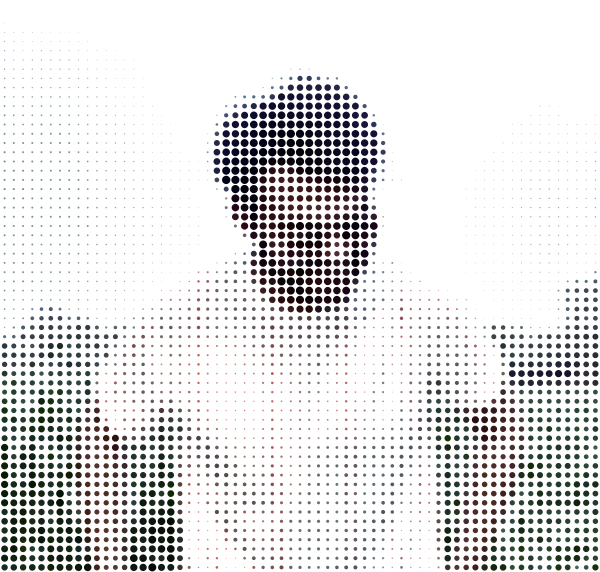
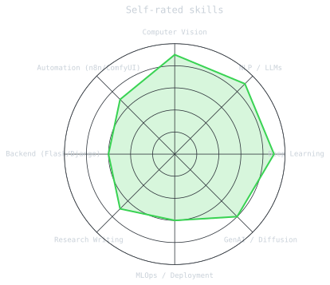

<div align="center">

<!-- PORTRAIT - generated by scripts/dotify.py from assets/jacket.jpg.
     Colour mode, so one file serves both GitHub themes. Regenerate with:
       python scripts/dotify.py assets/jacket.jpg -o assets/portrait \
         --cols 65 --equalize --detail 0.55 --color -->


<br>

<a href="https://github.com/Arjunvankani">
  
</a>

<br>

<a href="https://www.linkedin.com/in/arjun-vankani/"></a>
<a href="mailto:vankaniarjun0103@gmail.com"></a>
<a href="https://arjunvankani.github.io/arjun/"></a>
<a href="https://github.com/Arjunvankani"></a>


</div>

---

## `~/` whoami

```console
$ cat about.txt
```

Hi, I'm **Arjun Vankani** — an AI Engineer working across **Generative AI, Computer Vision, and NLP**,
currently exploring LLaMA fine-tuning, diffusion models, and CLIP-based retrieval.

- 🎓 M.Tech ICT (Machine Learning), Dhirubhai Ambani Institute of ICT — `2022–2024`
- 🧪 Currently exploring: **LLaMA fine-tuning**, **diffusion models**, **CLIP retrieval**
- 📘 Book chapter provisionally accepted: *Cybernetic Shield: Securing the Future of Machine Intelligence, 2025*
- 🥇 Shri Dewang Mehta IT Award — Top Ranker, B.E. (2022)
- 💬 Fun fact: guest lecturer who still debugs shape mismatches at 2 AM

<br>

```python
class Arjun:
    def __init__(self):
        self.role = "AI Engineer & Aspiring Research Scholar"
        self.focus = ["Generative AI", "Computer Vision", "NLP"]
        self.currently_exploring = ["LLaMA fine-tuning", "Diffusion models", "CLIP retrieval"]

    def say_hi(self):
        return "Let's build something intelligent 🚀"
```

---

<div align="center">

## `~/` toolbox


</div>

---

<div align="center">

## `~/` skill radar

<!-- Self-rated radar - edit assets/skills.json, .github/workflows/radar.yml redraws it -->
<picture>
  <source media="(prefers-color-scheme: dark)"  srcset="assets/radar-dark.svg">
  <source media="(prefers-color-scheme: light)" srcset="assets/radar-light.svg">
  
</picture>

</div>

---

<div align="center">

## `~/` contribution calendar

<!-- Isometric calendar, refreshed every 6h by .github/workflows/metrics.yml -->


</div>

---

<div align="center">

## `~/` the numbers


<br>


<br><br>


</div>

---

<div align="center">

## `~/` selected work

</div>

<table>
<tr>
<td width="50%" valign="top">

### 🌫️ Haze Removal in Re-ID
Built a **U-Net** based dehazing pipeline, outperforming DCP, COA, FFA & AOD baselines. Synthetic haze generated via beta/airlight tuning for light-to-heavy conditions.
`U-Net` `Image Restoration` `CV`

</td>
<td width="50%" valign="top">

### 🕵️ Person Re-ID for Surveillance
CNN + **Deep SORT** tracking, **Omni-Scale** feature extraction, and **FaceNet** for facial recognition — chained into a full re-identification pipeline.
`Deep SORT` `Omni-Scale` `FaceNet`

</td>
</tr>
<tr>
<td width="50%" valign="top">

### 🦙 LlamaWeb
Fine-tuned **LLaMA** into a domain-aware ChatGPT clone using **LangChain** embeddings for context-aware retrieval, evaluated with BLEU score.
`LLaMA` `LangChain` `RAG`

</td>
<td width="50%" valign="top">

### 🔍 CLIP Semantic Image Search
Text → Image retrieval engine using **CLIP embeddings**, searchable via CLI or local folders. Query "rainy road at night" and watch it find it.
`CLIP` `Embeddings` `Semantic Search`

</td>
</tr>
<tr>
<td width="50%" valign="top">

### ⚙️ ComfyUI × n8n Automation
CSV-driven pipeline that auto-routes tasks (upscale / text2img / video / segmentation / StyleGAN) to ComfyUI — one click, zero manual wiring.
`n8n` `ComfyUI` `Automation`

</td>
<td width="50%" valign="top">

### 🌎 Environmental AI Toolkit
Gradio app bundling sentiment analysis, NER, Q&A, object detection/segmentation, and **Stable Diffusion** scene generation for environmental data.
`Gradio` `Stable Diffusion` `NLP + CV`

</td>
</tr>
</table>

---

## 📜 Certifications

<div align="center">

`Applied ML in Python – U. Michigan` `Python for Data Science – IBM` `GenAI with LLMs – AWS`
`ML Specialization – Stanford` `Neural Networks & Deep Learning – DeepLearning.AI` `Data Analysis with R – Google`

</div>

---

<div align="center">

### 💬 Let's Talk AI, Research, or Ridiculous Side Projects

<a href="mailto:vankaniarjun0103@gmail.com"></a>

<sub>`01100001 01110010 01101010 01110101 01101110`</sub>

</div>
